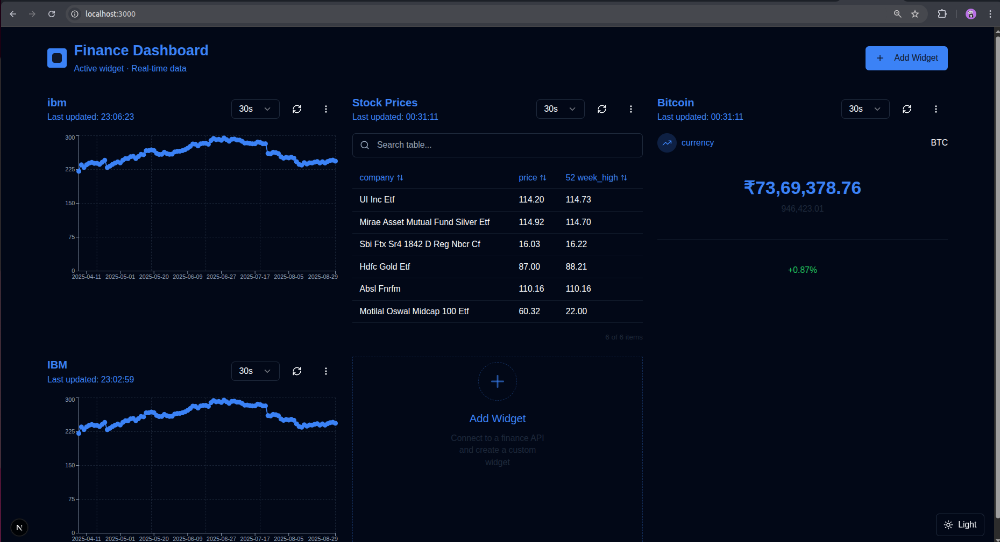

### Widget Forge (Next.js)

Widget Forge is a customizable dashboard builder for assembling real‑time data widgets (cards, tables, charts) from arbitrary JSON APIs. It ships with a secure server-side proxy, field selection, sorting/search, periodic refresh, and light/dark themes.

---

# Features

- __Dashboard builder__: Add, remove, and reorder widgets via drag-and-drop.
- __Data widgets__: Card, Table, and Chart widgets powered by flexible JSON mapping.
- __Field selection__: Inspect a sample response, pick fields to display, and persist per widget.
- __Search & sort__: Filter table rows and sort by any column.
- __Auto refresh__: Per-widget refresh intervals (10s/30s/1m/5m).
- __Error handling__: Inline error banners and disabled actions while loading.
- __Secure API proxy__: Server route for external API calls with caching and rate limiting.
- __Theming__: One-click dark/light theme toggle with persisted preference.

---

# Screenshots

Dark theme


Light theme


---

# Tech Stack

- __Next.js 15__ (App Router)
- __React 18__
- __TypeScript__
- __Tailwind CSS v4__ + `tailwindcss-animate`
- __Zustand__ for state management
- __@tanstack/react-query__ for async states
- __Radix UI__ primitives and `lucide-react` icons
- __Recharts__ for charting

---

# Project Structure

- `app/` – App Router, pages, components, API routes
  - `components/` – UI and widget components
    - `AppClient.tsx` – app providers and global UI
    - `Dashboard.tsx` – main dashboard
    - `components/widgets/` – `CardWidget.tsx`, `TableWidget.tsx`, `ChartWidget.tsx`
    - `ThemeToggle.tsx` – theme switcher (persists in localStorage)
  - `api/proxy/route.ts` – secure server proxy for external APIs
  - `lib/dataMapper.ts` – JSON normalization and field selection helpers
  - `store/widgetStore.ts` – Zustand store, widget CRUD, refresh logic
- `public/` – static assets (screenshots: `home.png`, `home-light.png`)

---

# Quick Start

1) Install dependencies
```bash
npm install
```

2) Run dev server
```bash
npm run dev
```
Open http://localhost:3000

3) Build & run production
```bash
npm run build
npm start
```

4) Lint
```bash
npm run lint
```

---

# Configuration

- __Environment variables__: keep API secrets off the client. Set them in your shell or `.env.local` (not committed). Example variable names are up to your APIs; see Proxy usage below for passing `authEnv`.
- __Theming__: The theme toggle writes `data-theme="light|dark"` on `<html>`; Tailwind tokens are bound in `app/globals.css`. Adjust CSS variables to customize brand colors.
- __Refresh intervals__: Configurable per widget via the widget header dropdown.

---

# Secure API Proxy

Route: `POST /api/proxy` implemented in `app/api/proxy/route.ts`.

- __Why__: call third‑party APIs from the server to avoid exposing keys and to centralize rate limit/cache.
- __Request body__ (example):
```json
{
  "url": "https://example.com/data",
  "method": "GET",
  "headers": { "Accept": "application/json" },
  "body": null,
  "cacheTtlMs": 30000,
  "authEnv": "MY_API_KEY" // optional, injects value from process.env.MY_API_KEY
}
```

- __Rate limiting__: per‑IP sliding window (see `route.ts` to adjust). On limit, returns HTTP 429 with a friendly message; the UI surfaces it in the widget.
- __Caching__: in‑memory cache keyed by URL+headers+body with configurable TTL (`cacheTtlMs`).
- __Security__: never hardcode keys in frontend. Provide `authEnv` and set the corresponding environment variable.

---

# Using the App

- __Add a widget__: use the “Add Widget” button on the dashboard.
- __Test an API__: provide a URL; the app fetches a sample via the proxy.
- __Pick fields__: choose which fields to display per widget.
- __Reorder__: drag cards/tables/charts to rearrange.
- __Search & sort__: available on tables via the header and search bar.
- __Refresh__: choose an interval from the widget toolbar; manual refresh is also available.
- __Theme__: use the floating theme toggle to switch dark/light.

---

# Deployment

Any platform that runs Node.js works:

- __Vercel__: zero‑config for Next.js. Set your environment variables in Project Settings → Environment Variables.
- __Docker/VM__: build with `npm run build` then `npm start`. Expose port 3000. Ensure environment variables are provided.

---

# Troubleshooting

- __429 Too Many Requests__: you hit the proxy limit or the upstream provider’s quota. Increase server window/limit or slow the widget refresh interval.
- __CORS issues__: always call third‑party APIs through `/api/proxy`, not directly from the browser.
- __Empty/odd data__: adjust selected fields. Use `app/lib/dataMapper.ts` helpers for normalization.
- __Styling inconsistencies__: verify `data-theme` is present on `<html>` and tokens in `app/globals.css` are set.

---

# License

MIT — see LICENSE if provided; otherwise treat as proprietary for now.
